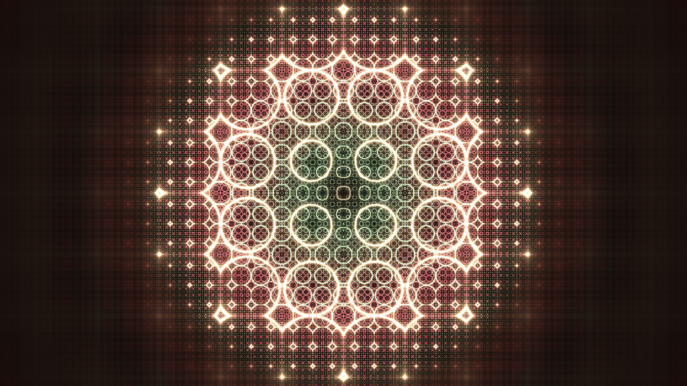

# Project GLSL

## Context
Every Graphic Card has different layers of complexity behind it.
But every ( or most ) use OpenGL for a Graphic Card Pipeline.

OpenGL offers a lot of option, but in our case, it allows us to "code animation".

## How it is done ?
By using the OpenGL Shading Language, based on C, we can perform that.

Especially, in that case, I have used shadertoy.com ( https://www.shadertoy.com )

Basically, it allows us, without anymore libraires, to create visual animation, both in 2D and 3D.

As a beginner my animation is pretty psychedelic and chaotic but it allows anyone to program it's own animation, and is pretty extensive.

## How to use it ?

- Open https://www.shadertoy.com/new
- Copy paste the content of code.txt
- Compile
- Click "play"

## Demonstration Video 
<video width="1920" height="1080" controls>
  <source src="opengl_vector.mp4" type="video/mp4">
  Votre navigateur ne prend pas en charge le tag vidéo.
</video>
